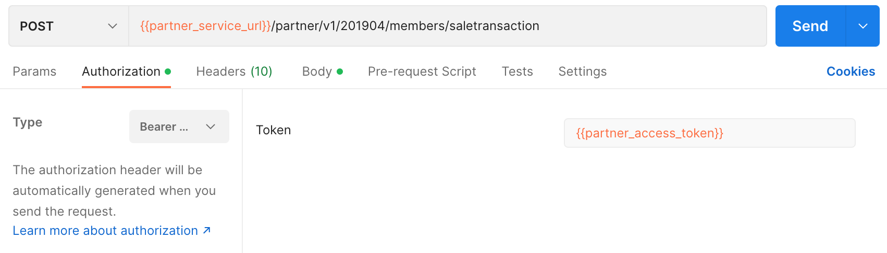
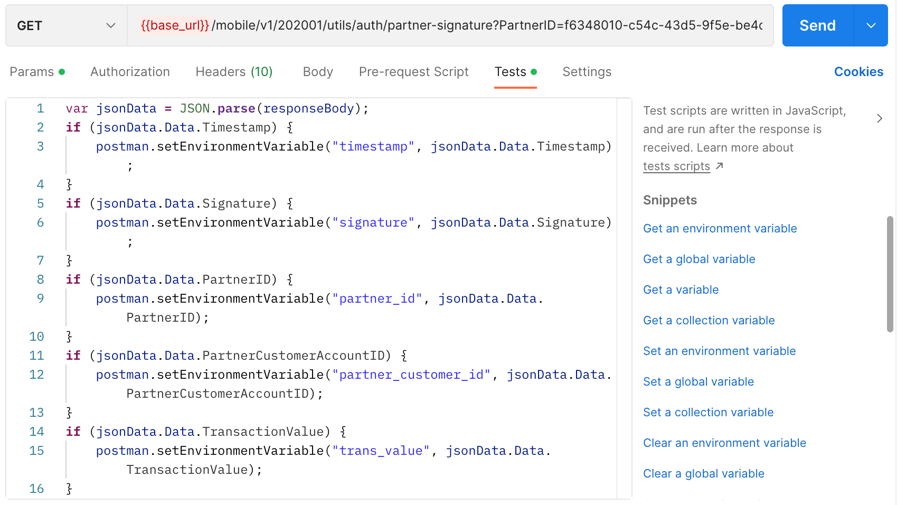
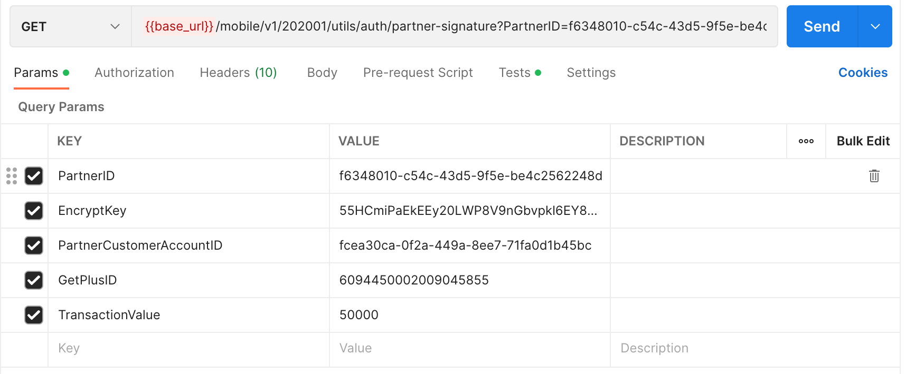

## Earn Point / Sale Transaction

Endpoint
````
[POST] {{partner_service_url}}/partner/v1/201904/members/saletransaction
````
````
[GET] {{base_url}}/mobile/v1/202001/utils/auth/partner-signature?PartnerID=f6348010-c54c-43d5-9f5e-be4c2562248d&EncryptKey=55HCmiPaEkEEy20LWP8V9nGbvpkl6EY8USqDkaRRlrk=&PartnerCustomerAccountID=fcea30ca-0f2a-449a-8ee7-71fa0d1b45bc&GetPlusID=6094450002009045855&TransactionValue=50000
````
to access earn point / sale transaction, use the token obtained earlier at login as ``basic authentication``, on postman select ``authorization`` next to ``params``, then select ``Bearer Token``, then select ``{{partner_access_token}}`` or you can use contains the token obtained from the previous ``partner_token`` response.



## Test
and also, select ``test`` and add this code.



after that, use this ``json`` file with the format below to post earn point.
````
{
    "PartnerID": "f6348010-c54c-43d5-9f5e-be4c2562248d",
    "GetPlusID": "6094450002009045855",
    "Signature": "NgGMogyQeOxXgjW9E2giHFSivs13PphLVhB9m7CcUG8=",
    "Timestamp": "1661926366",
    "TransactionValue": 100000,
    "TransactionID": "GETPLUS/0221/002",
    "TerminalID": "10001"
}
````
## GET Method
for *GET* method, add this in ``params``.



## Result
````
{
    "ErrorCode": 0,
    "ErrorDescription": "",
    "Data": {
        "LoyaltyPointsBalance": 767500,
        "TransactionID": "GETPLUS/0221/061",
        "TransactionSet_RSN": "b49d3c5f-1002-45e1-ac71-869fe4f6c977"
    }
}
````
## Error Condition
if send same TransactionID 2 times
````
{
    "ErrorCode": "20215",
    "ErrorDescription": "Duplicate Transaction ID"
}
````
if send invalid/empty/expired token
````
{
    "ErrorCode": -12,
    "ErrorDescription": "You are not authorize"
}
````
if send invalid signature
````
{
    "ErrorCode": -14,
    "ErrorDescription": "You are not authorize"
}
````
if send invalid/empty/expired token and sent invalid signature
````
{
    "ErrorCode": -12,
    "ErrorDescription": "You are not authorize"
}
````