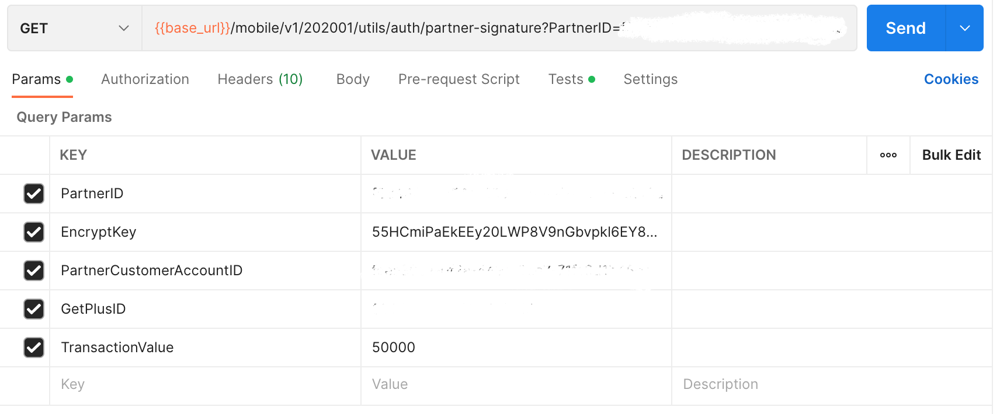

## Earn Point / Sale Transaction

### Endpoint
````
[POST] {{partner_service_url}}/partner/v1/201904/members/saletransaction
````
````
[GET] {{base_url}}/mobile/v1/202001/utils/auth/partner-signature?PartnerID=(confidential data)&EncryptKey=55HCmiPaEkEEy20LWP8V9nGbvpkl6EY8USqDkaRRlrk=&PartnerCustomerAccountID=(confidential data)&GetPlusID=(confidential data)&TransactionValue=50000
````
to access earn point / sale transaction, use variables ``{{partner_access_token}}`` or you can use the token obtained from the previous ``partner token`` response as ``basic authentication``, on postman select ``authorization`` next to ``params``, then select ``Bearer Token``, then you choose one of the options above to be used as a token.


### Test
and also, select ``test`` and add this code.


````
var jsonData = JSON.parse(responseBody);
if (jsonData.Data.Timestamp) {
    postman.setEnvironmentVariable("timestamp", jsonData.Data.Timestamp);
}
if (jsonData.Data.Signature) {
    postman.setEnvironmentVariable("signature", jsonData.Data.Signature);
}
if (jsonData.Data.PartnerID) {
    postman.setEnvironmentVariable("partner_id", jsonData.Data.PartnerID);
}
if (jsonData.Data.PartnerCustomerAccountID) {
    postman.setEnvironmentVariable("partner_customer_id", jsonData.Data.PartnerCustomerAccountID);
}
if (jsonData.Data.TransactionValue) {
    postman.setEnvironmentVariable("trans_value", jsonData.Data.TransactionValue);
}
````

### POST Method
Use this ``json`` file with the format below to insert earn point.
````
{
    "PartnerID": "(confidential data)",
    "GetPlusID": "(confidential data)",
    "Signature": "NgGMogyQeOxXgjW9E2giHFSivs13PphLVhB9m7CcUG8=",
    "Timestamp": "1661926366",
    "TransactionValue": 100000,
    "TransactionID": "GETPLUS/(confidential data)/(confidential data)",
    "TerminalID": "(confidential data)"
}
````
for `PartnerID`,`GetplusID`,`TransactionID` and `TerminalID` is confidential data. So, use the previously obtained `PartnerID`,`GetplusID`,`TransactionID` and `TerminalID`.

### GET Method
For *GET* method, add this in ``params``.



for `PartnerID`,`PartnerCustomerAccountID` and `GetplusID` is confidential data. So, use the previously obtained `PartnerID`,`PartnerCustomerAccountID` and `GetplusID`.

### Result 
````
{
    "ErrorCode": 0,
    "ErrorDescription": "",
    "Data": {
        "LoyaltyPointsBalance": 767500,
        "TransactionID": "GETPLUS/(confidential data)/(confidential data)",
        "TransactionSet_RSN": "(confidential data)"
    }
}
````
### Error Condition
if send same TransactionID 2 times.
````
{
    "ErrorCode": "20215",
    "ErrorDescription": "Duplicate Transaction ID"
}
````
if send invalid/empty/expired token.
````
{
    "ErrorCode": -12,
    "ErrorDescription": "You are not authorize"
}
````
if send invalid signature.
````
{
    "ErrorCode": -14,
    "ErrorDescription": "You are not authorize"
}
````
if send invalid/empty/expired token and sent invalid signature.
````
{
    "ErrorCode": -12,
    "ErrorDescription": "You are not authorize"
}
````