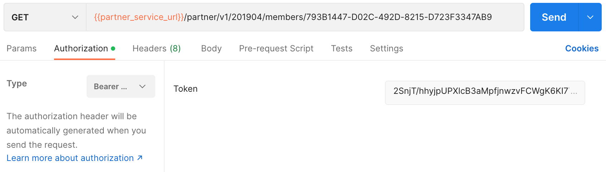

## Member Profile

### Endpoint
````
[GET] {{partner_service_url}}/partner/v1/201904/members/793B1447-D02C-492D-8215-D723F3347AB9
````
to get member profile, use the token obtained from the previous ``partner token`` response as ``basic authentication``, on postman select ``authorization`` next to ``params``, then select ``Bearer Token``, then paste token.



### Result
````
{
    "Data": {
        "AvailableBalance": 767200,
        "GivenName": "Gpi",
        "FamilyName": "Ubeatz",
        "EmailAddress": "gpites01+ubeatz1@gmail.com",
        "PhoneNumber": "+62 81248073455",
        "Program": "GPS",
        "MembershipNumber": "6094450002009045855"
    },
    "ErrorCode": 0,
    "ErrorDescription": null
}
````
### Error Condition

If member non existing profile
````
{
    "ErrorCode": 30201,
    "ErrorDescription": "Member not found"
}
````