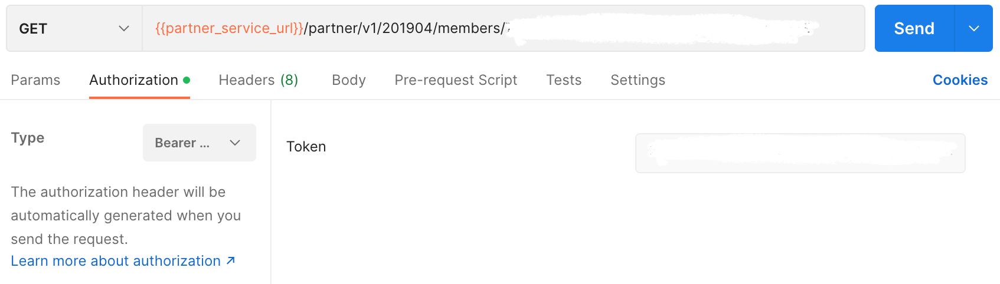

## Member Pofile

Endpoint
````
[GET] {{partner_service_url}}/partner/v1/201904/members/CCF28570-A59F-4E24-9530-EF808D7C5F99?access_token
````
to get member profile, use the token obtained earlier at login as ``basic authentication``, on postman select ``authorization`` next to ``params``, then select ``Bearer Token``, then copy and paste token.



## GET Method
for *GET* method, add this in ``params``.


## Result
````
{
    "Data": {
        "AvailableBalance": 767200,
        "GivenName": "Gpi",
        "FamilyName": "Ubeatz",
        "EmailAddress": "gpites01+ubeatz1@gmail.com",
        "PhoneNumber": "+62 81248073455",
        "Program": "GPS",
        "MembershipNumber": "6094450002009045855"
    },
    "ErrorCode": 0,
    "ErrorDescription": null
}
````
## Error Condition

if member non existing profile
````
{
    "ErrorCode": 30201,
    "ErrorDescription": "Member not found"
}
````