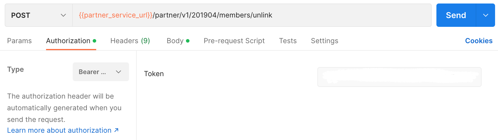
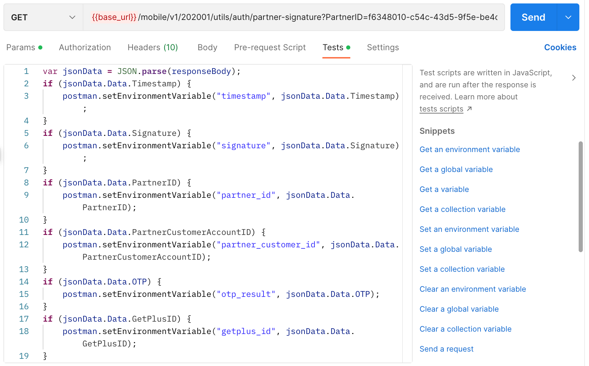
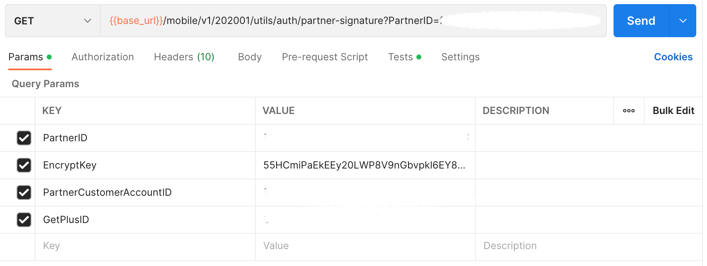

## Member Unlink

### Endpoint
````
[POST] {{partner_service_url}}/partner/v1/201904/members/unlink
````
````
[GET] {{base_url}}/mobile/v1/202001/utils/auth/partner-signature?PartnerID=f6348010-c54c-43d5-9f5e-be4c2562248d&EncryptKey=55HCmiPaEkEEy20LWP8V9nGbvpkl6EY8USqDkaRRlrk=&PartnerCustomerAccountID=fcea30ca-0f2a-449a-8ee7-71fa0d1b45bc&GetPlusID=6094450002009045855
````
to access unlink member, use the token obtained from the previous ``partner token`` response as ``basic authentication``, on postman select ``authorization`` next to ``params``, then select ``Bearer Token``, then paste token.



### Test
and also, select ``test`` and add this code.



````
var jsonData = JSON.parse(responseBody);
if (jsonData.Data.Timestamp) {
    postman.setEnvironmentVariable("timestamp", jsonData.Data.Timestamp);
}
if (jsonData.Data.Signature) {
    postman.setEnvironmentVariable("signature", jsonData.Data.Signature);
}
if (jsonData.Data.PartnerID) {
    postman.setEnvironmentVariable("partner_id", jsonData.Data.PartnerID);
}
if (jsonData.Data.PartnerCustomerAccountID) {
    postman.setEnvironmentVariable("partner_customer_id", jsonData.Data.PartnerCustomerAccountID);
}
if (jsonData.Data.OTP) {
    postman.setEnvironmentVariable("otp_result", jsonData.Data.OTP);
}
if (jsonData.Data.GetPlusID) {
    postman.setEnvironmentVariable("getplus_id", jsonData.Data.GetPlusID);
}
````

### POST Method
Use this ``json`` file with the format below to insert unlink member.
````
{
    "PartnerCustomerAccountID": "fcea30ca-0f2a-449a-8ee7-71fa0d1b45bc",
    "PartnerID": "f6348010-c54c-43d5-9f5e-be4c2562248d",
    "GetPlusID": "6094450002009045855",
    "Signature": "atAR2HIkfVCB+pU+T0QVewHMATCpdF+WgApEWJF/PH8=",
    "Timestamp": "1662111091"
}
````
### GET Method
For *GET* method, add this in ``params``.



### Result POST Method
````
{
    "ErrorCode": 0,
    "ErrorDescription": "",
    "Data": {
        "Timestamp": 1664343761,
        "Signature": "gPEHkwifUdCyiYTIfsL0cj7Lx7dSeBCBd1SbQyVLhe4=",
        "PartnerID": "f6348010-c54c-43d5-9f5e-be4c2562248d",
        "GetPlusID": "6094450002009045855"
    }
}
````
## Result GET Method
If unlink member success
````
{
    "ErrorCode": 0,
    "ErrorDescription": ""
}
````
## Error Condition
If send link 2 times.
````
{
    "ErrorCode": -1,
    "ErrorDescription": "Account is already Linked"
}
````
If input invalid id.
````
{
    "ErrorCode": -14,
    "ErrorDescription": "You are not authorize"
}
````
If input invalid partner id / id.
````
{
    "ErrorCode": -4,
    "ErrorDescription": "Partner not found"
}
````