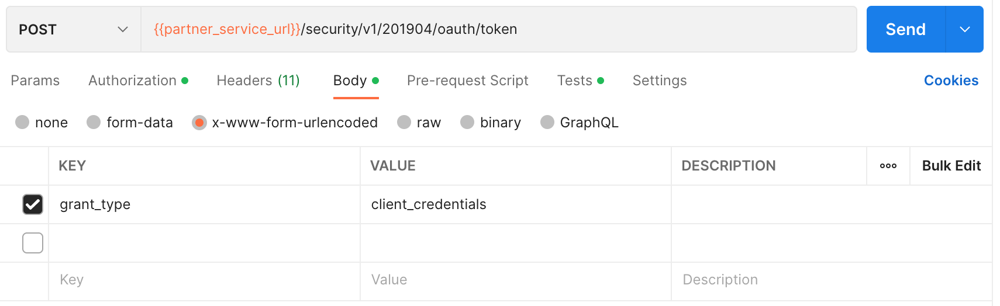
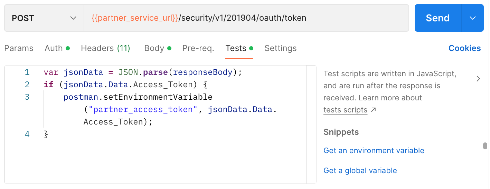

## Partner Token

### Endpoint
````
[POST] {{partner_service_url}}/security/v1/201904/oauth/token 
````
Before request OTP, you must login using ``username`` and ``password`` for the authorization process as ``basic authentication`` to get token. On postman select ``authorization`` next to ``params``, then select ``Basic Auth``.


Then, select body ``x-www-urlencoded`` and add *grant_type* as ``key``.



### Test
and also, select ``test`` and add this code.



````
var jsonData = JSON.parse(responseBody);
if (jsonData.Data.Access_Token) {
    postman.setEnvironmentVariable("partner_access_token", jsonData.Data.Access_Token);
}
````

### Result
````
{
    "ErrorCode": 0,
    "ErrorDescription": "",
    "Data": {
        "TokenExpiry": "2023-01-04T06:26:19Z",
        "Access_Token": "eyJhbGciOiJIUzUxMiIsInR5cCI6IkpXVCJ9.eyJSc25BUFAiOiI0QzVCQzEzQi1GNUU4LTQ4RDMtODU4QS0zNUYwNEFFOTdDMkQiLCJSc25PUkciOiJDREY0OTIwNS1ENUZELTQwMDEtQTVGOC04RUM2MTQ0M0ZFMzUiLCJDbGllbnRJRCI6ImMxMGQ2YzM2LWU5ZTItNDc2NC04OTk1LTI2OThlYzM5ZWUzZiIsIkNsaWVudFNlY3JldCI6ImtDeVZ5Nno2N1pVaVlPNExzWmhMRWZYOW9JNmtMeCIsIklQQWRkcmVzcyI6IiIsIkNyZWF0ZWQiOiIyMDIzLTAxLTAzVDA2OjI2OjE5IiwiRXhwaXJlZCI6IjIwMjMtMDEtMDRUMDY6MjY6MTlaIiwiU2NvcGUiOiJQYXJ0bmVyIEludGVncmF0aW9uIiwiVG9rZW5SU04iOiIzZmU2ODc5NS1mMWQxLTQ0MWMtOWRhZi0xNWUyN2E3YWRhMDEiLCJQYXRoIjoiaHR0cHM6Ly9wYXJ0bmVycy1kZXYuZ3BpYXBpcy5jb20vc2VjdXJpdHkvdjEvMjAxOTA0L29hdXRoL3Rva2VuIiwiaWF0IjoxNjcyNzI3MTc5LCJleHAiOjE2NzI4MTM1NzksImp0aSI6ImoxS2Q0K091RnMxTU5GT1RHVnJxbDB0c2FqamYrNXp4Y3RXeGJBQVFCWEU9In0.g52PIuRdK3TMI9X0yX2ndKHvyEsXJdraTtOHjOrbyzw-slpIjHqexkBUUpM58g54NPm_eDOHgOSjFUrEHYTXeA",
        "Token_Type": "bearer"
    }
}
````