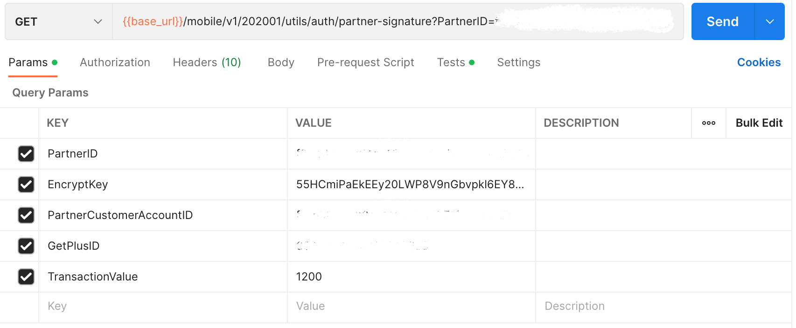

## Point Redeem

### Endpoint
````
[POST] https://partners-dev.gpiapis.com/partner/v1/201904/members/pointredeem
````
````
[GET] {{base_url}}/mobile/v1/202001/utils/auth/partner-signature?PartnerID=f6348010-c54c-43d5-9f5e-be4c2562248d&EncryptKey=55HCmiPaEkEEy20LWP8V9nGbvpkl6EY8USqDkaRRlrk=&PartnerCustomerAccountID=fcea30ca-0f2a-449a-8ee7-71fa0d1b45bc&GetPlusID=6094450002009045855&TransactionValue=1200
````
to access point redeem, use variables ``{{partner_access_token}}`` or you can use the token obtained from the previous ``partner token`` response as ``basic authentication``, on postman select ``authorization`` next to ``params``, then select ``Bearer Token``, then you choose one of the options above to be used as a token.


### Test
and also, select ``test`` and add this code.


````
var jsonData = JSON.parse(responseBody);
if (jsonData.Data.Timestamp) {
    postman.setEnvironmentVariable("timestamp", jsonData.Data.Timestamp);
}
if (jsonData.Data.Signature) {
    postman.setEnvironmentVariable("signature", jsonData.Data.Signature);
}
if (jsonData.Data.PartnerID) {
    postman.setEnvironmentVariable("partner_id", jsonData.Data.PartnerID);
}
if (jsonData.Data.PartnerCustomerAccountID) {
    postman.setEnvironmentVariable("partner_customer_id", jsonData.Data.PartnerCustomerAccountID);
}
if (jsonData.Data.TransactionValue) {
    postman.setEnvironmentVariable("trans_value", jsonData.Data.TransactionValue);
}
````

### POST Method
Use this ``json`` file with the format below to insert point redeem.
````
{
    "PartnerID": "f6348010-c54c-43d5-9f5e-be4c2562248d",
    "GetPlusID": "6094450002009045855",
    "Signature": "5FrtmjEyJu4ofVIEQUZ/XBsymJxzzLE5CYtpCZH2s4Q=",
    "Timestamp": "1661859537",
    "TransactionValue": 1200,
    "TransactionID": "SO/587411/0221/0078",
    "TerminalID": "10001"
}
````
### GET Method
For *GET* method, add this in ``params``.



### Result
````
{
    "ErrorCode": 0,
    "ErrorDescription": "",
    "Data": {
        "LoyaltyPointsBalance": 766300,
        "TransactionID": "SO/587411/0221/0078",
        "TransactionSet_RSN": "761d492b-2fd1-4508-8987-b8c7dad343d2"
    }
}
````
### Error Condition
If send same TransactionID 2 times.
````
{
    "ErrorCode": "20215",
    "ErrorDescription": "Duplicate Transaction ID"
}
````
If send invalid/empty/expired token.
````
{
    "ErrorCode": -12,
    "ErrorDescription": "You are not authorize"
}
````
If send invalid signature.
````
{
    "ErrorCode": -14,
    "ErrorDescription": "You are not authorize"
}
````
If send invalid/empty/expired token and sent invalid signature.
````
{
    "ErrorCode": -12,
    "ErrorDescription": "You are not authorize"
}
````