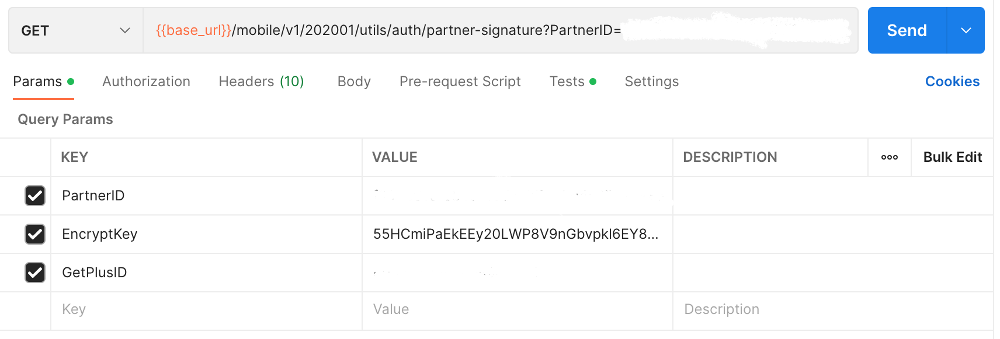

## Request OTP

### Endpoint
````
[POST] {{partner_service_url}}/security/v1/201904/oauth/otp 
````
````
[GET] {{base_url}}/mobile/v1/202001/utils/auth/partner-signature?PartnerID=(confidential data)&EncryptKey=55HCmiPaEkEEy20LWP8V9nGbvpkl6EY8USqDkaRRlrk=&GetPlusID=(confidential data)
````
to get OTP, use the token obtained from the previous ``partner token`` response as ``basic authentication``, on postman select ``authorization`` next to ``params``, then select ``Bearer Token``, then paste token.


### Test 
and also, select ``test`` and add this code.


````
var jsonData = JSON.parse(responseBody);
if (jsonData.Data.Timestamp) {
    postman.setEnvironmentVariable("timestamp", jsonData.Data.Timestamp);
}
if (jsonData.Data.Signature) {
    postman.setEnvironmentVariable("signature", jsonData.Data.Signature);
}
if (jsonData.Data.PartnerID) {
    postman.setEnvironmentVariable("partner_id", jsonData.Data.PartnerID);
}
if (jsonData.Data.GetPlusID) {
    postman.setEnvironmentVariable("getplus_id", jsonData.Data.GetPlusID);
}
````

### POST Method
Use this ``json`` file with the format below to insert request otp.
````
{
    "PartnerID": "(confidential data)",
    "GetPlusID": "(confidential data)",
    "Signature": "Kytny4DWs8lgeDv+9TSuUznZR480V6G6n90o2tvI9L0=",
    "Timestamp": "1662092274"
}
````
for `PartnerID` and `GetplusID` is confidential data. So, use the previously obtained `PartnerID` and `GetplusID`. 

### GET Method
For *GET*  method, add this in ``params``.



for `PartnerID` and `GetplusID` is confidential data. So, use the previously obtained `PartnerID` and `GetplusID`.

### Result
````
{
    "ErrorCode": 0,
    "ErrorDescription": "",
    "Data": {
        "Timestamp": 1664343761,
        "Signature": "gPEHkwifUdCyiYTIfsL0cj7Lx7dSeBCBd1SbQyVLhe4=",
        "PartnerID": "(confidential data)",
        "GetPlusID": "(confidential data)"
    }
}
````
### Error Condition
if request more than 3 times
````
{
    "ErrorCode": 42201,
    "ErrorDescription": "Maximum OTP reach"
}
````