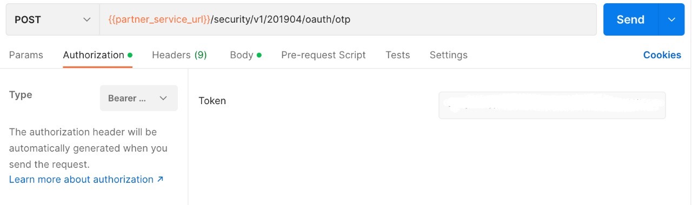
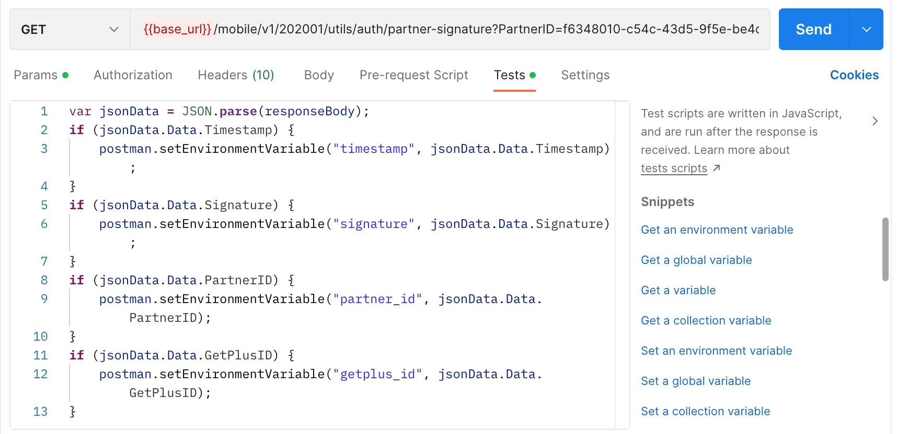

## Request OTP

Endpoint
````
[POST] {{partner_service_url}}/security/v1/201904/oauth/otp 
````
````
[GET] {{base_url}}/mobile/v1/202001/utils/auth/partner-signature?PartnerID=f6348010-c54c-43d5-9f5e-be4c2562248d&EncryptKey=55HCmiPaEkEEy20LWP8V9nGbvpkl6EY8USqDkaRRlrk=&GetPlusID=6094450002009045855
````
to get OTP, use the token obtained earlier at login as ``basic authentication``. on postman select ``authorization`` next to ``params``, then select ``Bearer Token``, then copy and paste token.



and also, select ``test`` and add this code.



after that, use this ``json`` file with the format below to post request otp.
````
{
    "PartnerID": "f6348010-c54c-43d5-9f5e-be4c2562248d",
    "GetPlusID": "6094450002009045855",
    "Signature": "Kytny4DWs8lgeDv+9TSuUznZR480V6G6n90o2tvI9L0=",
    "Timestamp": "1662092274"
}
````
## Result
````
{
    "ErrorCode": 0,
    "ErrorDescription": "",
    "Data": {
        "Timestamp": 1664343761,
        "Signature": "gPEHkwifUdCyiYTIfsL0cj7Lx7dSeBCBd1SbQyVLhe4=",
        "PartnerID": "f6348010-c54c-43d5-9f5e-be4c2562248d",
        "GetPlusID": "6094450002009045855"
    }
}
````
## Error Condition
Endpoint
````
[POST] {{partner_service_url}}/security/v1/201904/oauth/otp?access_token 
````
## Error Result
if request more than 3 times
````
{
    "ErrorCode": 42201,
    "ErrorDescription": "Maximum OTP reach"
}
````