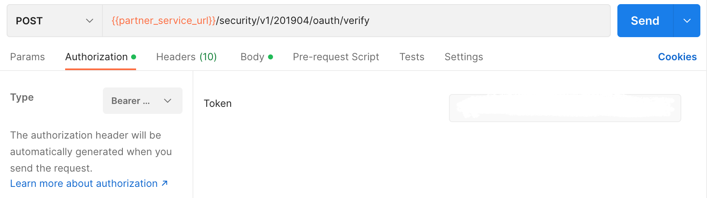
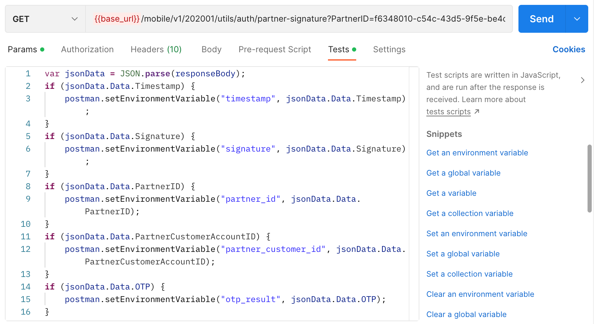
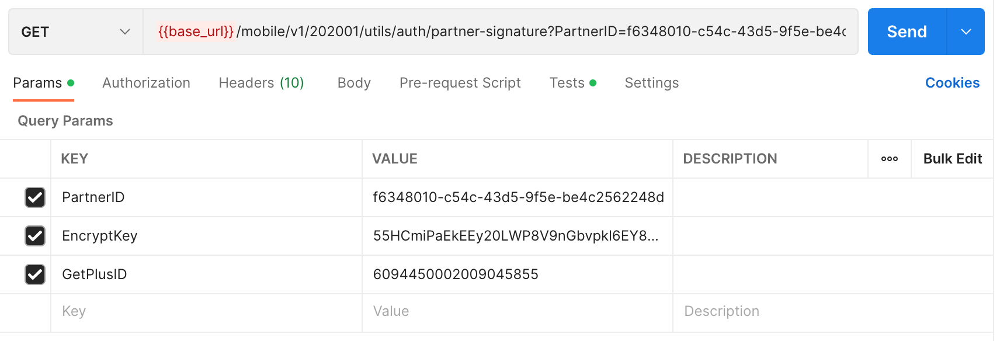

## Verify OTP

### Endpoint
````
[POST] {{partner_service_url}}/security/v1/201904/oauth/verify 
````
````
[GET] {{base_url}}/mobile/v1/202001/utils/auth/partner-signature?PartnerID=f6348010-c54c-43d5-9f5e-be4c2562248d&EncryptKey=55HCmiPaEkEEy20LWP8V9nGbvpkl6EY8USqDkaRRlrk=&GetPlusID=6094450002009045855
````
to verify OTP, use the token obtained from the previous ``partner token`` response as ``basic authentication``, on postman select ``authorization`` next to ``params``, then select ``Bearer Token``, then paste token.



### Test
and also, select ``test`` then add this code.



````
var jsonData = JSON.parse(responseBody);
if (jsonData.Data.Timestamp) {
    postman.setEnvironmentVariable("timestamp", jsonData.Data.Timestamp);
}
if (jsonData.Data.Signature) {
    postman.setEnvironmentVariable("signature", jsonData.Data.Signature);
}
if (jsonData.Data.PartnerID) {
    postman.setEnvironmentVariable("partner_id", jsonData.Data.PartnerID);
}
if (jsonData.Data.PartnerCustomerAccountID) {
    postman.setEnvironmentVariable("partner_customer_id", jsonData.Data.PartnerCustomerAccountID);
}
if (jsonData.Data.OTP) {
    postman.setEnvironmentVariable("otp_result", jsonData.Data.OTP);
}
````

### POST Method
Use this ``json`` file with the format below to verify OTP.
````
{
    "PartnerCustomerAccountID": "fcea30ca-0f2a-449a-8ee7-71fa0d1b45bc",
    "PartnerID": "f6348010-c54c-43d5-9f5e-be4c2562248d",
    "GetPlusID": "6094450002009045855",
    "Signature": "EROGkFQkA0kswYIsIZstEbirg8MxTStoY0ZwOvBpY4I=",
    "Timestamp": "1662101936",
	"OTP": "817270"
}
````
### GET Method
For *GET*  method, add this in ``params`` 



### Result POST Method 
````
{
    "Data": {
        "MemberApplicationID": "C538482A-6514-4E64-BE2E-00E7238BFE8D",
        "JoinCode": 1,
        "MembershipNumber": "6094450002009045855"
    },
    "ErrorCode": 0,
    "ErrorDescription": null
}
````
### Result GET Method 
````
{
    "ErrorCode": 0,
    "ErrorDescription": "",
    "Data": {
        "Timestamp": 1664343761,
        "Signature": "gPEHkwifUdCyiYTIfsL0cj7Lx7dSeBCBd1SbQyVLhe4=",
        "PartnerID": "f6348010-c54c-43d5-9f5e-be4c2562248d",
        "GetPlusID": "6094450002009045855"
    }
}
````
### Error Condition
If the otp expired.
````
{
    "ErrorCode": -16,
    "ErrorDescription": "OTP code expired"
}
````
If the otp invalid.
````
{
    "ErrorCode": -16,
    "ErrorDescription": "OTP code expired"
}
````