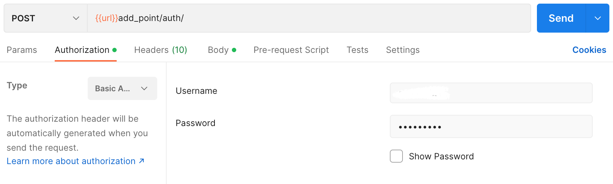

## Add Point

Endpoint
````
[POST] url/add_point/auth/ 
````
Before adding points, make sure you already have an account, ``username``  and ``password`` will be used as ``basic authentication`` to add points. on postman select ``authorization`` next to ``params``, then select ``basic auth type``, then enter the username and password that were registered previously.



## Body JSON
after that, use this ``json`` file with the format below to add point
````
{
    "email" : "anonim12@gmail.com",
    "userid" : 2,
    "value_point" : 60
}
````
## Result
````
{
    "Status": true,
    "message": "added point successfully",
    "results": {
        "master": [
            {
                "id_addpoint": 1,
                "value_point": 60,
                "email": "anonim12@gmail.com",
                "userid": 2,
                "created_at": "2022-12-28T08:09:22.057864"
            }
        ]
    }
}
````