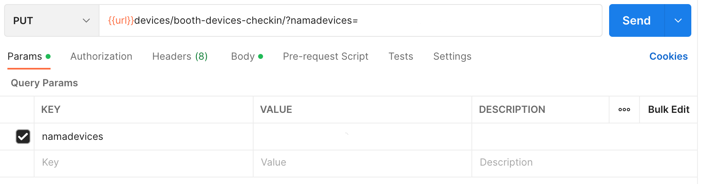

## Devices > Checkin Item

Endpoint
````
[PUT] url/devices/booth-devices-checkin/?namadevices=73d7f26052f2c1a0
````

## PUT Method
For *PUT* method, use *namadevices* as ``params``.



and also, add this ``json`` file with the format below to update checkin item.
````
{
    "status" : 1,
    "user" : 2,
    "durasi" : 3,
    "addtime" : 1
}
```` 

## Result PUT Method
````
{
    "message": "successfully",
    "status": true,
    "count": 1,
    "results": {
        "devices": [
            {
                "iddevices": 3,
                "namadevices": "73d7f26052f2c1a0",
                "nama": "73d7f26052f2c1b0",
                "status": 1,
                "players": 1,
                "codeconnect": "3832",
                "jam": "2023-01-06T04:18:57.920774",
                "userid": null,
                "durasi": 3,
                "addtime": 1,
                "codeoutlet": "UBT",
                "idtransaksi": null,
                "ipaddress": "192.168.1.26",
                "user": "2"
            }
        ]
    }
}
````

## Devices > Checkin Item Code

Endpoint
````
[PUT] url/devices/booth-devices-checkin-code/?code=3832
````

## PUT Method
For *PUT* method, use *code* as ``params``.


and also, add this ``json`` file with the format below to update checkin item code.
````
{
    "status" : 1,
    "iduser" : 2,
    "durasi" : 3,
    "addtime" : 1
}
```` 

## Result PUT Method
````
{
    "message": "successfully",
    "status": true,
    "count": 1,
    "results": {
        "devices": [
            {
                "iddevices": 3,
                "namadevices": "73d7f26052f2c1a0",
                "nama": "73d7f26052f2c1b0",
                "status": 1,
                "players": 1,
                "codeconnect": "3832",
                "jam": "2023-01-06T05:19:18.052560",
                "userid": 2,
                "durasi": 3,
                "addtime": 1,
                "codeoutlet": "UBT",
                "idtransaksi": null,
                "ipaddress": "192.168.1.26",
                "user": "2"
            }
        ]
    }
}
````

## Conclusion 
the difference between *Devices > Checkin Item* and *Devices > Checkin Item Code* :

1. ``params``, on *Devices > Checkin Item* the parameter used is *namadevices*, while on *Devices > Checkin Item Code* the parameter used is *code*.
2. Naming the ``json`` file in the user section. On *Devices > Checkin Item* use ``user``, while on *Devices > Checkin Item Code* use ``iduser``.
