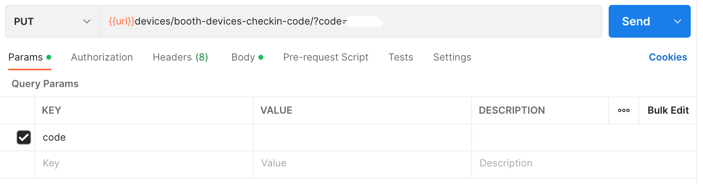

## Devices > Checkin Item

### Endpoint
````
[PUT] url/devices/booth-devices-checkin/?namadevices=(confidential data)
````

### PUT Method
For *PUT* method, use *namadevices* as ``params``.


and also, add this ``json`` file with the format below to update checkin item.
````
{
    "status" : 1,
    "user" : (confidential data),
    "durasi" : 3,
    "addtime" : 1
}
```` 

### Result PUT Method
````
{
    "message": "successfully",
    "status": true,
    "count": 1,
    "results": {
        "devices": [
            {
                "iddevices": (confidential data),
                "namadevices": "(confidential data)",
                "nama": "(confidential data)",
                "status": 1,
                "players": 1,
                "codeconnect": "(confidential data)",
                "jam": "2023-01-06T04:18:57.920774",
                "userid": null,
                "durasi": 3,
                "addtime": 1,
                "codeoutlet": "UBT",
                "idtransaksi": null,
                "ipaddress": "(confidential data)",
                "user": "(confidential data)"
            }
        ]
    }
}
````

## Devices > Checkin Item Code

### Endpoint
````
[PUT] url/devices/booth-devices-checkin-code/?code=(confidential data)
````

### PUT Method
For *PUT* method, use *code* as ``params``.



and also, add this ``json`` file with the format below to update checkin item code.
````
{
    "status" : 1,
    "iduser" : (confidential data),
    "durasi" : 3,
    "addtime" : 1
}
```` 

### Result PUT Method
````
{
    "message": "successfully",
    "status": true,
    "count": 1,
    "results": {
        "devices": [
            {
                "iddevices": (confidential data),
                "namadevices": "(confidential data)",
                "nama": "73d7f26052f2c1b0",
                "status": 1,
                "players": 1,
                "codeconnect": "(confidential data)",
                "jam": "2023-01-06T05:19:18.052560",
                "userid": (confidential data),
                "durasi": 3,
                "addtime": 1,
                "codeoutlet": "UBT",
                "idtransaksi": null,
                "ipaddress": "(confidential data)",
                "user": "(confidential data)"
            }
        ]
    }
}
````

## Conclusion 
the difference between *Devices > Checkin Item* and *Devices > Checkin Item Code* :

|                    | **Devices > Checkin Item** | **Devices > Checkin Item Code** |
| ------------------ | -------------------------- | ------------------------------- |
| Params             |      *namadevices*         |             *code*              |
| Naming `json` file |   user section >  `user`   |     user section >  `iduser`    |
