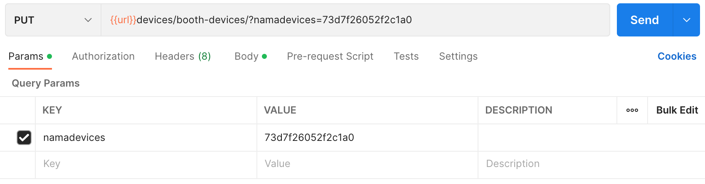

## Devices

### Endpoint
````
[POST] url/devices/booth-devices/
````
````
[GET] url/devices/booth-devices/ 
````
````
[PUT] url/devices/booth-devices/?namadevices=73d7f26052f2c1a0
````

### POST Method
Use this ``json`` file with the format below to insert devices.
````
{
    "namadevices" : "73d7f26052f2c1a0",
    "status" : 1,
    "players" : 1,
    "durasi" : 4,
    "addtime" : 2,
    "codeconnect" : "3832",
    "codeoutlet" : "UBT",
    "namabooth" : "73d7f26052f2c1a0",
    "ipadd" : "192.168.1.26"
}
````

### PUT Method
For *PUT* method, use *namadevices* as ``params``.



and also, add this ``json`` file with the format below to update devices.
````
{
    "codeconnect" : 3832,
    "code" : "UBT",
    "namabooth" : "73d7f26052f2c1b0"
}
```` 

### Result POST Method
````
{
    "message": "successfully",
    "status": true,
    "count": 1,
    "results": {
        "devices": [
            {
                "iddevices": 3,
                "namadevices": "73d7f26052f2c1a0",
                "nama": "73d7f26052f2c1a0",
                "status": 1,
                "players": 1,
                "codeconnect": "3832",
                "jam": null,
                "userid": null,
                "durasi": 4,
                "addtime": 2,
                "codeoutlet": "UBT",
                "idtransaksi": null,
                "ipaddress": "192.168.1.26",
                "user": null
            }
        ],
        "tools": [
            {
                "id": 1,
                "runtext": [
                    {
                        "text": "Selamat Datang Di Karaoke"
                    },
                    {
                        "text": "Free 1 Jam Gratis 1 Jam"
                    },
                    {
                        "text": "Discount 10% Khusus Member"
                    }
                ],
                "promo": [
                    {
                        "path": "http://8.215.47.1/imgpromo/1.png"
                    },
                    {
                        "path": "http://8.215.47.1/imgpromo/2.png"
                    },
                    {
                        "path": "http://8.215.47.1/imgpromo/3.png"
                    },
                    {
                        "path": "http://8.215.47.1/imgpromo/4.png"
                    }
                ],
                "opening": [
                    {
                        "path": "http://8.215.47.1/promo.mp4"
                    }
                ],
                "setting": [
                    {
                        "urlserver_lagu": "http://10.0.1.200/data/"
                    }
                ],
                "code": "UBT",
                "keterangan": "Ubeatz"
            }
        ]
    }
}
````

### Result GET Method
````
{
    "message": "successfully",
    "status": true,
    "count": 1,
    "results": {
        "devices": [
            {
                "iddevices": 3,
                "namadevices": "73d7f26052f2c1a0",
                "nama": "73d7f26052f2c1a0",
                "status": 1,
                "players": 1,
                "codeconnect": "3832",
                "jam": null,
                "userid": null,
                "durasi": 4,
                "addtime": 2,
                "codeoutlet": "UBT",
                "idtransaksi": null,
                "ipaddress": "192.168.1.26",
                "user": null
            }
        ]
    }
}
````

### Result PUT Method
````
{
    "message": "successfully",
    "status": true,
    "count": 1,
    "results": {
        "devices": [
            {
                "iddevices": 3,
                "namadevices": "73d7f26052f2c1a0",
                "nama": "73d7f26052f2c1b0",
                "status": 1,
                "players": 1,
                "codeconnect": "3832",
                "jam": null,
                "userid": null,
                "durasi": 4,
                "addtime": 2,
                "codeoutlet": "UBT",
                "idtransaksi": null,
                "ipaddress": "192.168.1.26",
                "user": null
            }
        ]
    }
}
````