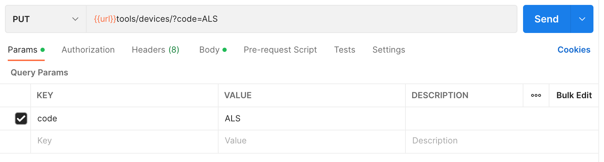

## Tools

### Endpoint
````
[POST] url/tools/devices/
````
````
[GET] url/tools/devices/ 
````
````
[PUT] url/tools/devices/?code=ALS
````

### POST Method
Use this ``json`` file with the format below to insert tools.
````
{
    "runtext" : [{"text": "Selamat Datang Di Karaoke"},{"text": "Free 1 Jam Gratis 1 Jam"},{"text": "Discount 10% Khusus Member"}],
    "promo" : [{"path": "http://8.215.47.1/imgpromo/1.png"}, {"path": "http://8.215.47.1/imgpromo/2.png"},{"path": "http://8.215.47.1/imgpromo/3.png"}, {"path": "http://8.215.47.1/imgpromo/4.png"}],
    "opening" : [{"path": "http://8.215.47.1/promo.mp4"}],
    "setting" : [{"urlserver_lagu": "http://8.215.47.1/booth/lagu/"}],
    "code" : "ALS",
    "keterangan" : "Ubeatz"
}
````

### PUT Method
For *PUT* method, use *code* as ``params``.



and also, add this ``json`` file with the format below to update tools.
````
{
    "runtext" : [{"text": "Selamat Datang Di Karaoke"},{"text": "Free 1 Jam Gratis 1 Jam"},{"text": "Discount 10% Khusus Member"}],
    "promo" : [{"path": "http://8.215.47.1/imgpromo/1.png"}, {"path": "http://8.215.47.1/imgpromo/2.png"},{"path": "http://8.215.47.1/imgpromo/3.png"}],
    "opening" : [{"path": "http://8.215.47.1/promo.mp4"}],
    "setting" : [{"urlserver_lagu": "http://8.215.47.1/booth/lagu/"}],
    "keterangan" : "Ubeatz"
}
```` 

### Result POST Method
````
{
    "message": "successfully",
    "status": true,
    "count": 1,
    "results": {
        "devices": [
            {
                "id": 2,
                "runtext": [
                    {
                        "text": "Selamat Datang Di Karaoke"
                    },
                    {
                        "text": "Free 1 Jam Gratis 1 Jam"
                    },
                    {
                        "text": "Discount 10% Khusus Member"
                    }
                ],
                "promo": [
                    {
                        "path": "http://8.215.47.1/imgpromo/1.png"
                    },
                    {
                        "path": "http://8.215.47.1/imgpromo/2.png"
                    },
                    {
                        "path": "http://8.215.47.1/imgpromo/3.png"
                    },
                    {
                        "path": "http://8.215.47.1/imgpromo/4.png"
                    }
                ],
                "opening": [
                    {
                        "path": "http://8.215.47.1/promo.mp4"
                    }
                ],
                "setting": [
                    {
                        "urlserver_lagu": "http://8.215.47.1/booth/lagu/"
                    }
                ],
                "code": "ALS",
                "keterangan": "Ubeatz"
            }
        ]
    }
}
````

### Result GET Method
````
{
    "message": "successfully",
    "status": true,
    "count": 1,
    "results": {
        "Tools": [
            {
                "id": 1,
                "runtext": [
                    {
                        "text": "Selamat Datang Di Karaoke"
                    },
                    {
                        "text": "Free 1 Jam Gratis 1 Jam"
                    },
                    {
                        "text": "Discount 10% Khusus Member"
                    }
                ],
                "promo": [
                    {
                        "path": "http://8.215.47.1/imgpromo/1.png"
                    },
                    {
                        "path": "http://8.215.47.1/imgpromo/2.png"
                    },
                    {
                        "path": "http://8.215.47.1/imgpromo/3.png"
                    },
                    {
                        "path": "http://8.215.47.1/imgpromo/4.png"
                    }
                ],
                "opening": [
                    {
                        "path": "http://8.215.47.1/promo.mp4"
                    }
                ],
                "setting": [
                    {
                        "urlserver_lagu": "http://10.0.1.200/data/"
                    }
                ],
                "code": "UBT",
                "keterangan": "Ubeatz"
            },
            {
                "id": 2,
                "runtext": [
                    {
                        "text": "Selamat Datang Di Karaoke"
                    },
                    {
                        "text": "Free 1 Jam Gratis 1 Jam"
                    },
                    {
                        "text": "Discount 10% Khusus Member"
                    }
                ],
                "promo": [
                    {
                        "path": "http://8.215.47.1/imgpromo/1.png"
                    },
                    {
                        "path": "http://8.215.47.1/imgpromo/2.png"
                    },
                    {
                        "path": "http://8.215.47.1/imgpromo/3.png"
                    },
                    {
                        "path": "http://8.215.47.1/imgpromo/4.png"
                    }
                ],
                "opening": [
                    {
                        "path": "http://8.215.47.1/promo.mp4"
                    }
                ],
                "setting": [
                    {
                        "urlserver_lagu": "http://8.215.47.1/booth/lagu/"
                    }
                ],
                "code": "ALS",
                "keterangan": "Ubeatz"
            }
        ]
    }
}
````

### Result PUT Method
````
{
    "message": "successfully",
    "status": true,
    "count": 1,
    "results": {
        "devices": [
            {
                "id": 2,
                "runtext": [
                    {
                        "text": "Selamat Datang Di Karaoke"
                    },
                    {
                        "text": "Free 1 Jam Gratis 1 Jam"
                    },
                    {
                        "text": "Discount 10% Khusus Member"
                    }
                ],
                "promo": [
                    {
                        "path": "http://8.215.47.1/imgpromo/1.png"
                    },
                    {
                        "path": "http://8.215.47.1/imgpromo/2.png"
                    },
                    {
                        "path": "http://8.215.47.1/imgpromo/3.png"
                    }
                ],
                "opening": [
                    {
                        "path": "http://8.215.47.1/promo.mp4"
                    }
                ],
                "setting": [
                    {
                        "urlserver_lagu": "http://8.215.47.1/booth/lagu/"
                    }
                ],
                "code": "ALS",
                "keterangan": "Ubeatz"
            }
        ]
    }
}
````

### Error Condition
If use the same code.
````
{
    "message": "successfully",
    "status": true,
    "count": 1,
    "results": {
        "pesan": "Code sudah terpakai"
    }
}
````