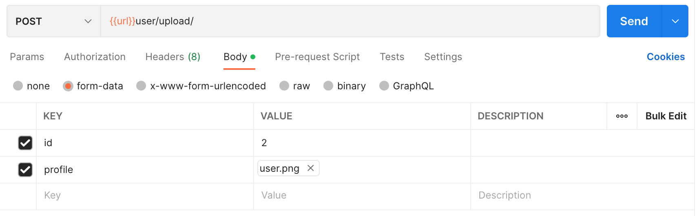

## Upload Profile Picture

### Endpoint
````
[POST] url/user/upload/ 
````
````
[GET] url/user/upload/ 
````

### POST Method
for *POST* method, add this in ``params``.



### Result POST Method
````
{
    "Status": true,
    "message": "Image upload successfully",
    "results": {
        "id_up": (confidential data),
        "id": (confidential data),
        "profile": "http://(confidential data)/user/upload/media/profile/user.png"
    }
}
````
### Result GET Method
````
{
    "status": true,
    "message": "Successfully",
    "results": [
        {
            "id_up": (confidential data),
            "id": (confidential data),
            "profile": "media/profile/user.png"
        }
    ]
}
````