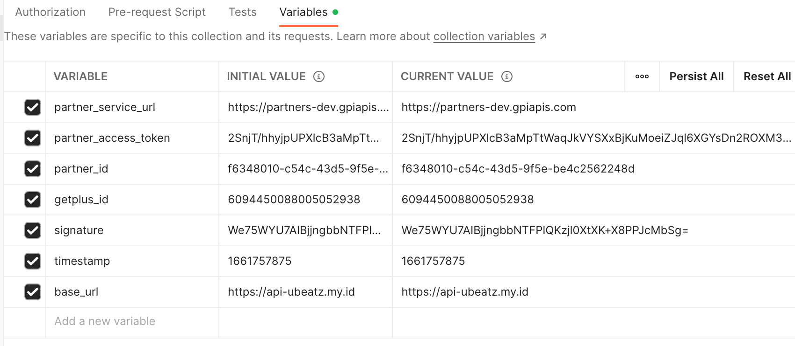

## Variable Settings

First step, you have to set a variable to access getplus. ``partner_id``, ``getplus_id``, ``signature``, and ``timestamp`` variables can change at any time according to the response received from the OTP request. And for ``partner_access_token``, contains the token obtained from the previous ``partner_token`` response.

